- 👋 Hi, I’m @Fhrozen 
- 👀 I’m interested in signal/sound/acoustics processing, machine learning, deep learning, speech and spoken language processing, and robotics.
- 🌱 I’m currently learning robotics.
- 💞️ I’m looking to collaborate on open source projects.
- 📫 How to reach me nelson.yalta@ieee.org

<!---
Fhrozen/Fhrozen is a ✨ special ✨ repository because its `README.md` (this file) appears on your GitHub profile.
You can click the Preview link to take a look at your changes.
--->
